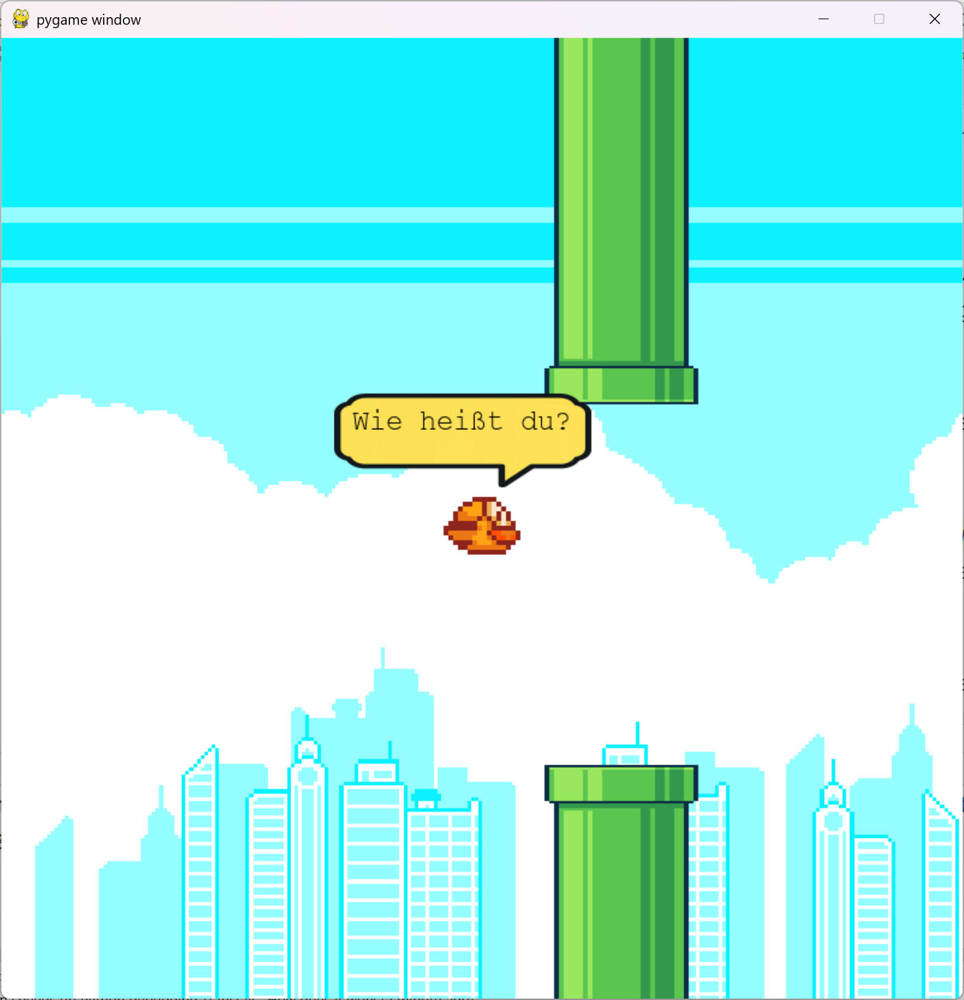
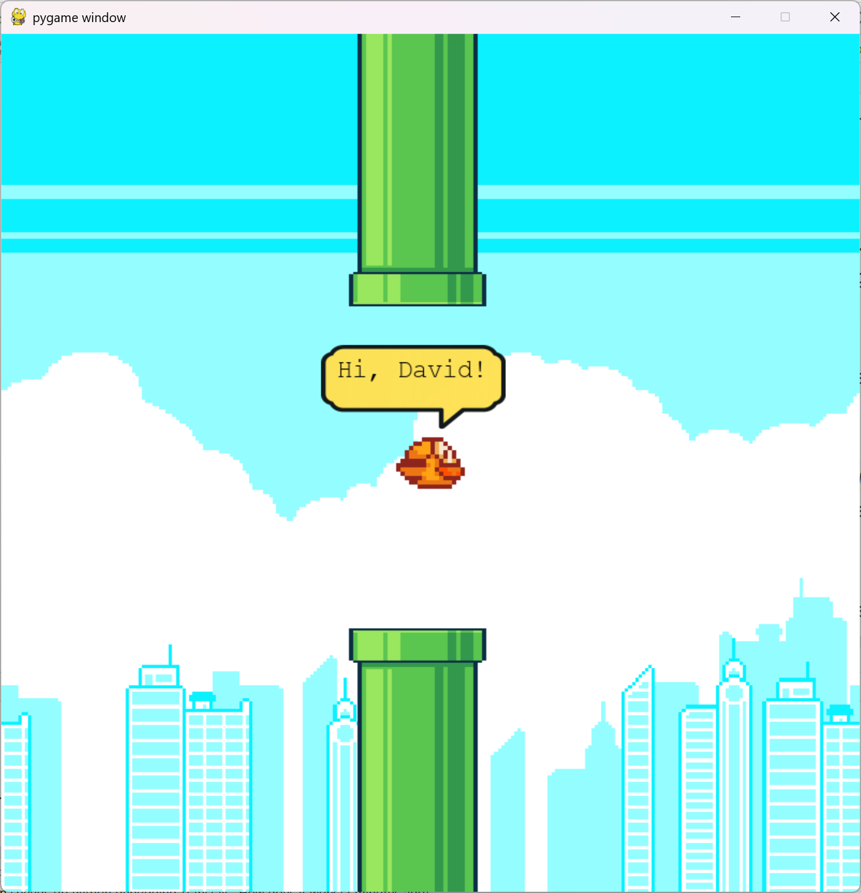

<style>
.solution {
  display: none;
}
</style>

# **FlappyBird Level 2**
Schreibe ein Programm, das:

1. den Benutzer fragt: 
   ```
   Wie heißt du?
   ```
2. den Benutzer begrüßt mit :
   ```
   Hi, <Dein Name>!
   ```
Füge deine Lösung in das File `student_code.py` ein!
```python
LEVEL = 2
def solution():
    # Füge hier deine Lösung ein!

```

:::hint
Mit der Funktion [`input`](https://www.w3schools.com/python/ref_func_input.asp) können `strings` von der Konsole eingelesen werden.
```py
alter_string = input("Dein alter? ")
```
Mit `f-strings` können Ausdrücke und Variablen direkt in einen **String** einfügen, ohne zusätzliche **Konvertierungen** oder **Formatierungen** durchführen zu müssen.
```py
schulstufe = 1
klasse = "AHIF"
schueler = 30
formatted_string = f"In die Klasse {schulstufe}{klasse} gehen {schueler} Schüler"
print(formatted_string)
```
>**Output:**
> ```
> In die Klasse 1AHIF gehen 30 Schüler
> ```
:::

| | |
|---|---|
|  |  |


:::solution
```python
LEVEL = 2
def solution():
    # Füge hier deine Lösung ein!
    name = input("Wie heißt du? ")
    print(f"Hi, {name}!")
```
:::