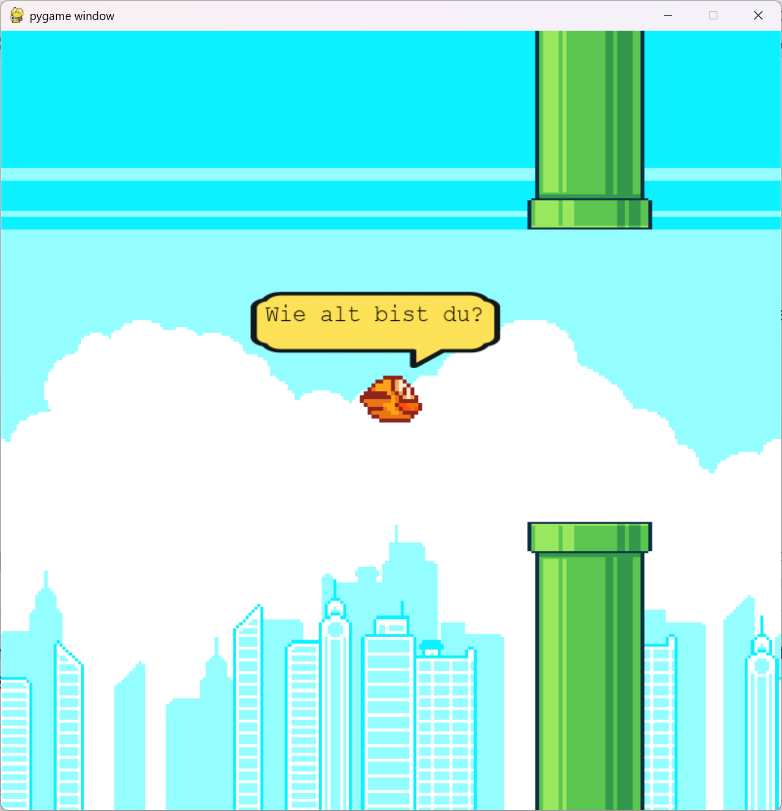
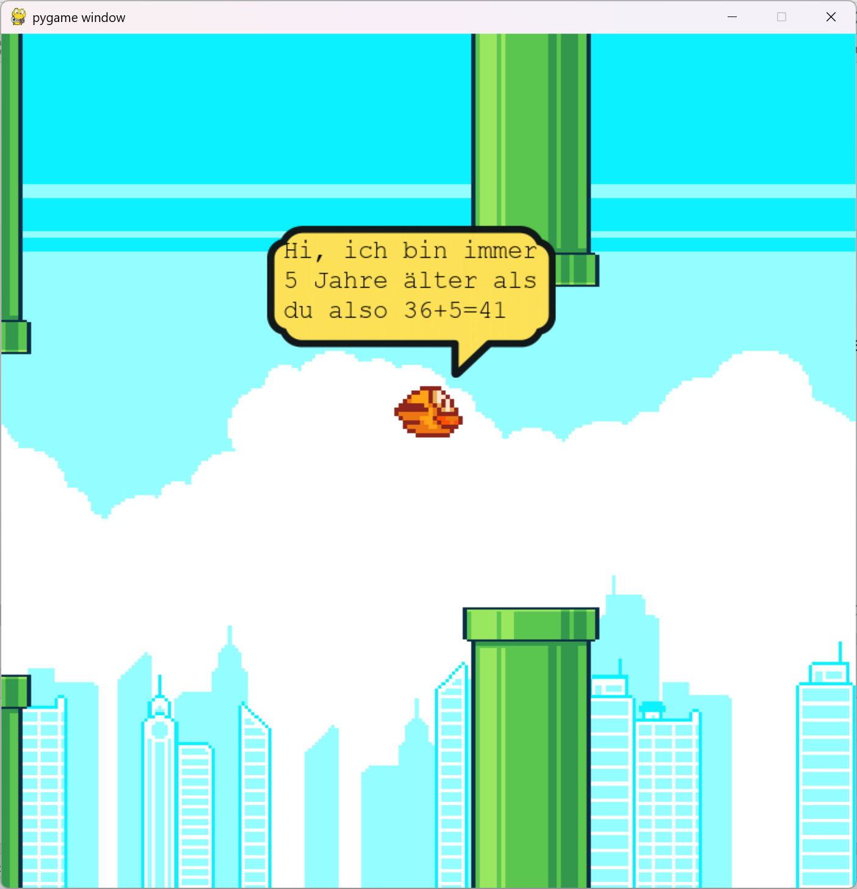

<style>
.solution {
  display: none;
}
</style>

# **FlappyBird Level 3**
Schreibe ein Programm, das:
1. den Benutzer fragt: 
   ```
   Wie alt bist du?
   ```
2. den Benutzer begrüßt mit:
   ```
   Hi, ich bin immer
   5 Jahre älter als
   du also 36+5=41
   ```
Füge deine Lösung in das File `student_code.py` ein!

```python
LEVEL = 3
def solution():
    # Füge hier deine Lösung ein!

```

:::hint
Zeilenumbrüche können mit dem **Steuerzeichen** `\n` im `string` gemacht werden!
```py
print("Zeilen\numbruch")
```
> **Output:** 
> ```
> Zeilen
> umbruch
> ```

Von der Konsole eingelesener Text ist vom Datentyp `string`! Um rechnen zu können muss dieser `string` zuerst zu einer ganzen Zahl `integer` umgewandelt werden.
```py
alter_string = "36"
alter_integer = int(alter_string)
alter_plus_fuenf = alter_integer + 5
print(f"{alter_string}+5={alter_plus_fuenf}")
```
> **Output:** 
> ```
> 36+5=41
> ```
:::

| | |
|---|---|
|  |  |

:::solution
```python
LEVEL = 3
def solution():
    # Füge hier deine Lösung ein!
    alter_string = input(f"Wie alt bist du? ")
    alter_integer = int(alter_string)
    alter_plus_fuenf = alter_integer + 5
    print(f"Hi, ich bin immer\n5 Jahre älter als\ndu also {alter_integer}+5={alter_plus_fuenf}")
```
:::