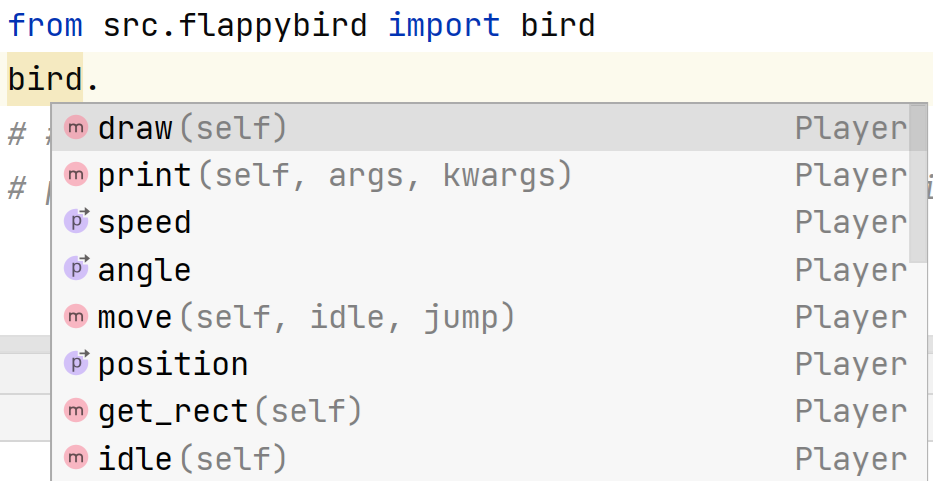
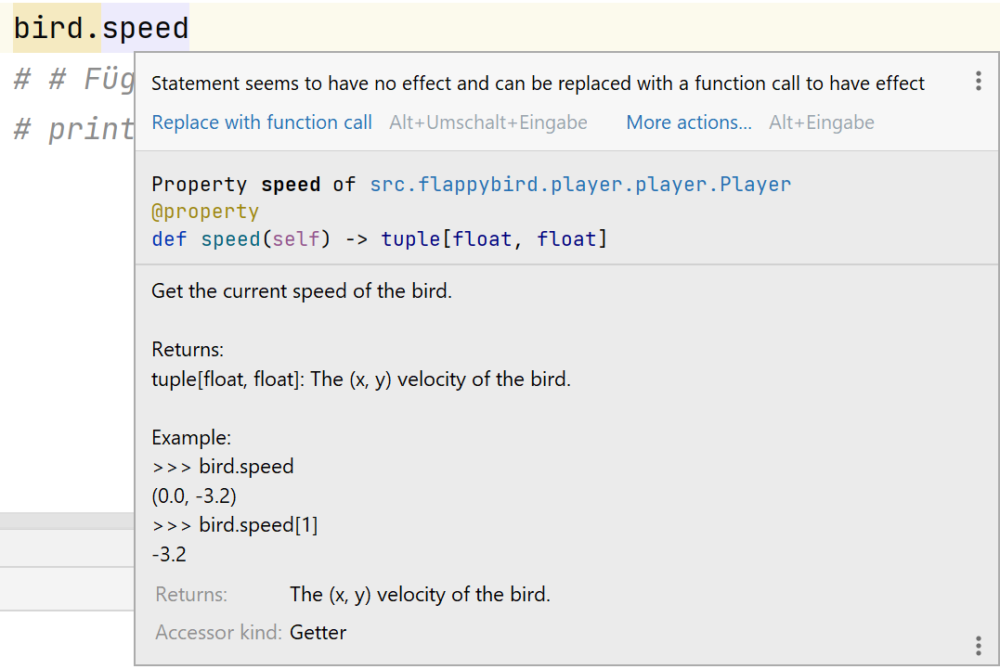
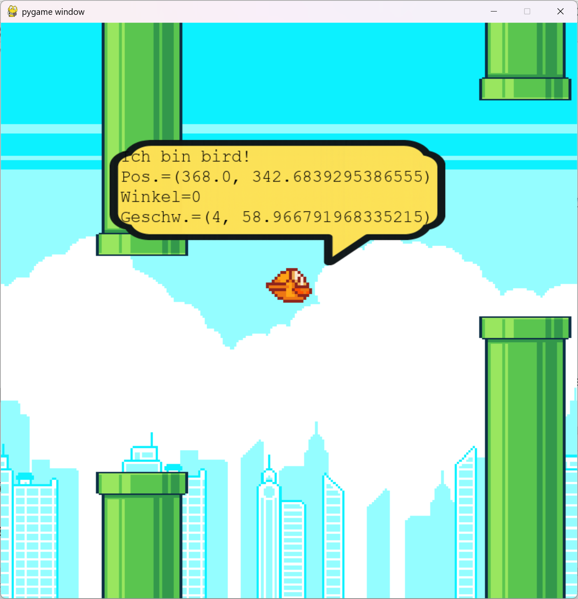

<style>
.solution {
  display: none;
}
</style>

# **FlappyBird Level 4: Eigenschaften, imports und f-strings**
Schreibe ein Programm, das folgende Statuswerte (Absolute Geschwindigkeit und Y-Position) vom Vogel **unformatiert** ausgibt.
```
Ich bin bird!
PosY.=339.34007093284737
GeschwAbs.=47.106826880658055
```

Füge deine Lösung in das File `student_code.py` ein!

```python
from flappybird.game import bird

LEVEL = 4


def solution():
# Füge hier deine Lösung ein!

```

:::hint
Mit dem ``import``

```py
from flappybird.game import bird
```
kannst du auf den Vogel (`bird`) zugreifen. Mit `bird.` kannst du sehen was für Eigenschaften, Variablen und Funktionen der Vogel anbietet.

`M` steht für Methoden(Funtktionen) und `P` steht für Properties(Eigenschaften). Wenn die Maus über der Eigenschaft oder Methode plaziert wird, wird die Hilfe dazu angezeigt.

:::



:::solution

```python
from flappybird.game import bird

LEVEL = 4


def solution():
    # Füge hier deine Lösung ein!
    print(f"Ich bin bird!\nPosY.={bird.position_y}\nGeschwAbs.={bird.speed_abs}")
```
:::