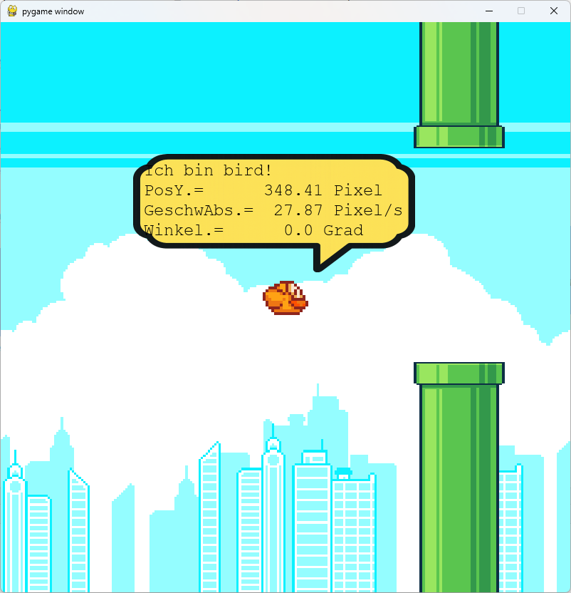

<style>
.solution {
  display: none;
}
</style>

# **FlappyBird Level 5: Formatiertes f-print**

Schreibe ein Programm, das folgende Statuswerte (Absolute Geschwindigkeit und Y-Position) vom Vogel **formatiert** auf zwei Nachkommastellen ausgibt.

```
Ich bin bird!
PosY.=      359.77 Pixel
GeschwAbs.=  45.75 Pixel/s
Winkel.=      0.0 Grad
```

Dabei soll die Ausgabe **rechtsbündig** mit festen Breiten erfolgen und auf **auf zwei Nachkommastellen** gerundet werden. 

:::warning
Es soll im f-String gerundet werden. Die Funktion `round` darf nicht verwendet werden. 
:::

Füge deine Lösung in das File `student_code.py` ein!

```python
from flappybird.game import bird
LEVEL = 5


def solution():
    # Füge hier deine Lösung ein!
```

:::hint
In f-Strings wie
```py
f"{expression:format}
```
wird alles nach dem **Doppelpunkt** wird als **Formatierungsanweisung** betrachtet. Soll eine Kommazahl (`float`) formatiert werden muss in der Formatierungsanweisung **f** stehen, soll stattdessen eine Ganzzahl formatiert werden **d**. 

|   Number   | Format  |   Output   |                      Description                      |
| :--------- | :------ | :--------: | :---------------------------------------------------- |
| 3.1415926  | {:.2f}  |    3.14    | float mit zwei Nachkommastellen                       |
| 3.1415926  | {:+.2f} |   +3.14    | float mit zwei Nachkommastellen und Vorzeichen        |
| -1         | {:+.2f} |   -1.00    | float mit zwei Nachkommastellen und Vorzeichen        |
| 2.71828    | {:.0f}  |     3      | float ohne Nachkommastellen                           |
| 2.71828    | {:6.2f} |   ␣␣2.72    | float mit insgesamt 6 Zeichen, aufgefüllt mit Space   |
| 2.71828    | {:06.2f} |   002.72  | float mit insgesamt 6 Zeichen, aufgefüllt mit 0     |
| 5          | {:0>2d} |     05     | Auffüllen der Zahl mit Nullen (left padding, width 2) |
| 5          | {:x<4d} |    5xxx    | Auffüllen der Zahl mit x-en (right padding, width 4)  |
| 10         | {:x<4d} |    10xx    | Auffüllen der Zahl mit x-en (right padding, width 4)  |
:::



:::solution

```python
from flappybird.game import bird

LEVEL = 5


def solution():
    # Füge hier deine Lösung ein!
    print(f"Ich bin bird!\nPosY.={bird.position_y:12.2f} Pixel\n"
          f"GeschwAbs.={bird.speed_abs:7.2f} Pixel/s\n"
          f"Winkel.={bird.angle:9.1f} Grad")
```
:::
