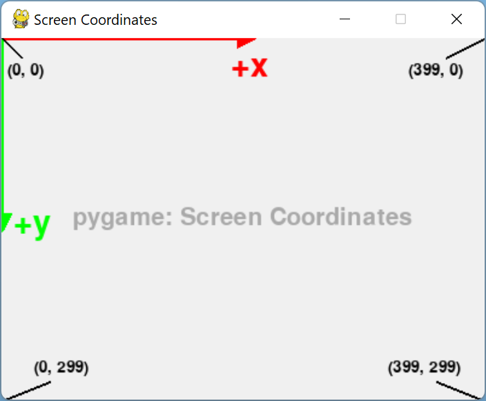
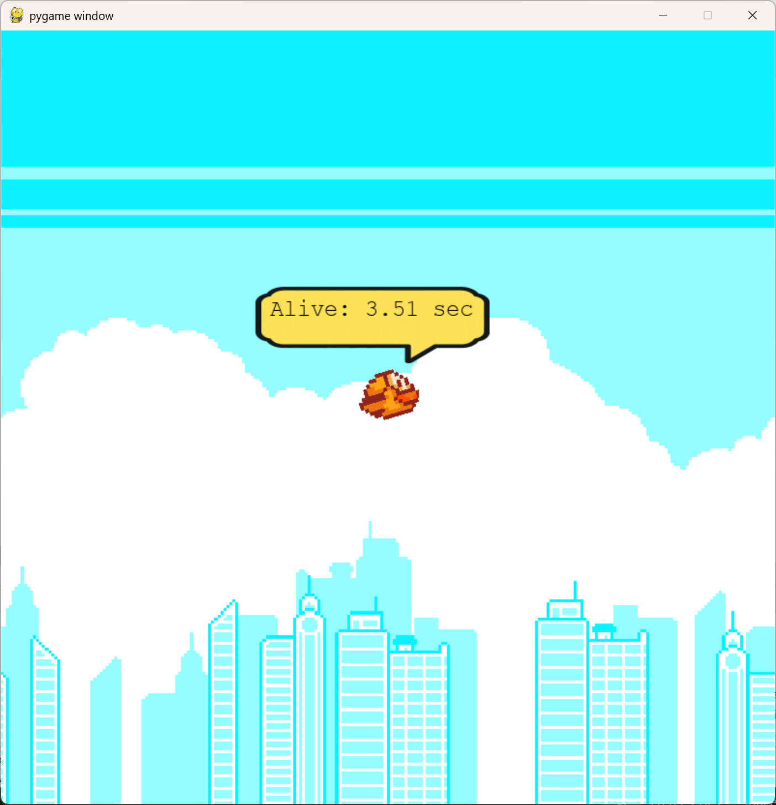

<style>
.solution {
  display: none;
}
</style>

# **FlappyBird Level 9: If Verzweigungen**

Schreibe ein Programm, das den FlappyBird für mindestens 10 Sekunden im Bildbereich bleibt. Zusätzlich soll ausgegeben werden wie lange `FlappyBird` am leben ist.
Das Format der Ausgabe soll wie folgt sein:
```
Alive: <Sekunden> s
```
Beispiel:
```
Alive: 1.5 s
```

Füge deine Lösung in das File `student_code.py` ein!

```python
from flappybird.game import bird
from flappybird.globals import globals
LEVEL = 9

def solution():
    # Füge hier deine Lösung ein!
```

:::hint
Du kannst FlappyBird mit folgendem Befehl springen lassen

```py
from flappybird.game import bird
bird.jump()
```
:::

### **If-Verzweigung**
:::hint
Eine `if`-Anweisung kann mehrere Formen haben. Eine einfache `if`-Anweisung ohne `else`-Teil sieht wie folgt aus. Dabei wird die Bedingung (condition) geprüft. Ist das Ergebnis dieser Prüfung `True`, werden die Anweisungen (statements) nach dem Doppelpunkt ausgeführt die entsprechend eingerückt sind (ein Tab). Ansonsten geschieht nichts.

```py
if condition:
    statement
else:
    statement
```

Beispiel:

```py
a = 5
b = 6

if (a + b > 10):
    print("The answer is greater than 10.")
else:
    print("The answer is less or equal than 10.")
```
:::

### **Koordinatensystem Pygame**
Im Koordinatensystem vom Pygame ist der Nullpunkt in der linken oberen Ecke und die y-Achse ist positiv nach unten.


### **Globale Spielvariablen**
Auf die **globalen Variaben** von FlappyBird kann mit dem Import

```py
from flappybird.globals import globals
```
zugegriffen werden. Darin finden sich unter anderem Variablen, die angeben, wie groß das Fenster von FlappyBird ist.
```py
from flappybird.globals import globals
bildhoehe = globals.SCREEN_HEIGHT  # Höhe des Spielfensters
```

### **Lösung**


:::solution

```python
from flappybird.game import bird
from flappybird.globals import globals

LEVEL = 9
def solution():
    # Füge hier deine Lösung ein!
    if (bird.position_y > globals.SCREEN_HEIGHT / 2):
        bird.jump()
    print(f"Alive: {bird.time_alive:.2f} s")
```
:::
